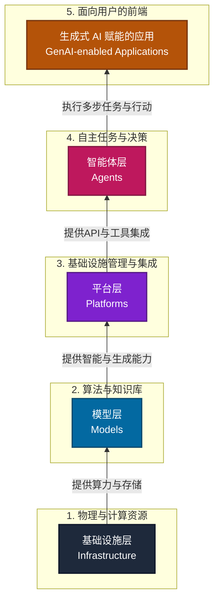
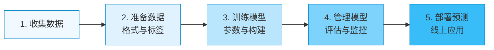

# **全面了解生成式 AI**

## **1\. “生成式 AI：全面了解生成式 AI”简介**

生成式 AI 正在重塑企业解决问题和创造价值的方式。在构建生成式 AI 解决方案时，情况千差万别。本指南旨在从底层基础设施到顶层应用，全面梳理生成式 AI 的技术架构，帮助您根据特定的业务需求，找到合适的切入点并推动创新。

## **2\. 了解生成式 AI 的各个层级**

从底层基础设施到人性化应用，生成式 AI 的每一个层级都在其功能中发挥着至关重要的作用。我们将生成式 AI 的运作方式划分为五个核心层级：**基础设施**、**模型**、**平台**、**智能体**和**生成式 AI 赋能的应用**。

### **2.1 五层架构图 (Mermaid 图解)**

下面这个层级图展示了生成式 AI 从底层算力到顶层用户界面的堆栈结构：

### **2.2 核心回顾：一个形象的类比**

为了更好地记忆这五个层级，我们可以将生成式 AI 的运作方式比作**一辆强大的汽车及它的驾驶系统**：

| 生成式 AI 层级 | 汽车比喻 | 扮演的角色 |
| :---- | :---- | :---- |
| **基础设施 (Infrastructure)** | **底盘与基础** | 承载一切的基石，提供物理动力。 |
| **模型 (Models)** | **核心引擎** | 提供源源不断的“智慧动力”和运转能力。 |
| **平台 (Platforms)** | **传动系统与车架** | 将引擎的动力传输分配，将所有独立部件连接成一个整体。 |
| **智能体 (Agents)** | **驾驶员** | 负责分析路况、制定路线、做出决策并采取实际的驾驶行动。 |
| **应用 (Applications)** | **整车车厢** | 最终面向乘客（用户）的载体，负责将我们安全舒适地带到目的地。 |

## **3\. 智能体和生成式 AI 赋能的应用**

在生成式 AI 的最顶层，**智能体 (Agents)** 和 **生成式 AI 赋能的应用 (Applications)** 往往是紧密结合、协同工作的。

### **3.1 什么是生成式 AI 智能体？**

生成式 AI 智能体是一种能够处理信息、对复杂概念进行推理并**采取行动**的应用组件。它会观察世界，并根据观察结果使用它所掌握的工具来采取实际行动，从而实现既定目标。

### **3.2 智能体与应用的关系**

您可以将智能体看作是大型生成式 AI 赋能应用中的**智能组成部分（引擎核心组件）**。应用则是面向用户的层级，为智能体的运行提供结构和上下文，并定义了界面和总体目标（如 Gemini、NotebookLM）。

智能体主要为应用带来以下三大核心能力：

1. **理解和响应自然语言**：打造能够真正理解用户复杂请求的界面。  
2. **自动执行复杂任务**：接管应用内的多步流程，实现高度自动化。  
3. **个性化体验**：学习并记忆用户偏好，定制千人千面的应用体验。

### **3.3 多智能体系统 (Multi-Agent Systems)**

通常情况下，一个成熟的应用会有**多个具有不同专长的智能体协同工作**。

* ✈️ **旅行预订应用**：智能体 A 处理查航班/酒店比价；智能体 B 推荐景点活动；应用层提供预订界面。  
* 🎧 **客户支持应用**：智能体负责回答问题、排查故障或上报人工；应用层提供聊天窗口。

## **4\. 智能体的工作原理**

### **4.1 两大核心阵营：对话与工作流**

* **对话智能体 (Conversational Agents)**：旨在理解您的深层意图并自然响应。运作流程为：接收输入 \-\> 理解意图 \-\> 调用工具获取信息 \-\> 生成拟人化回复。（示例：天气查询、智能聊天、百科问答）。  
* **工作流智能体 (Workflow Agents)**：旨在简化工作，自主执行复杂业务流程。运作流程为：触发流程 \-\> 解读任务步骤 \-\> 调用系统 API 和工具 \-\> 汇总并交付结果。（示例：电商订单自动履行、自动安全日志解析）。

### **4.2 智能体的“超能力”来源：推理循环与工具**

AI 智能体能超越大语言模型（LLM）的局限，是因为融合了：

1. **推理循环 (Reasoning Loop)**：持续迭代的“思考过程”：**观察 (Observe) \-\> 解读 (Interpret) \-\> 规划 (Plan) \-\> 行动 (Act)**。常依赖如思维链 (CoT) 等高级提示工程框架指导。  
2. **工具 (Tools)**：赋予智能体与外部真实世界交互的“手脚”（如访问数据库、调用软件 API、控制硬件设备）。

### **4.3 模型与智能体的能力边界辨析**

* **单纯的“模型”**：擅长文本生成、风格转换、语法修正、信息提取。  
* **“智能体”的进阶能力**：能够多步规划、自主联网搜集资料、调用外部系统、持续跟踪业务状态并采取实质性行动（如自动发推文、自动匹配并推送教育资源）。

## **5\. 平台层详解**

在实际应用中，从零开始自行构建机器学习解决方案可能非常复杂。**平台层 (Platform Layer)** 就像是一种强效“粘合剂”，它可以整合所有必要组件，为 AI 计划的构建和规模化提供坚实基础。

### **5.1 典型代表：Vertex AI**

以 Google Cloud 的 **Vertex AI** 为例，这是一个统一的机器学习 (ML) 平台。其核心优势包括：

1. 🔓 **开放而灵活**：支持主流开源框架，避免单一供应商绑定。  
2. 🏗️ **强大的基础设施**：依托 Google Cloud 可伸缩云端算力。  
3. 🧠 **预训练模型**：提供丰富的现成模型选项。  
4. 🛠️ **全面的工具与 IDE**：方便自定义和微调模型。  
5. 🔗 **轻松集成**：提供完善的 API 接入业务系统。

### **5.2 MLOps：高效与安全的模型运维流**

Vertex AI 内置了强大的 **MLOps（机器学习运维）工具集**：

* **特征存储区 (Feature Store)**：集中管理、分享特征数据。  
* **模型注册表 (Model Registry)**：管理模型版本、整理模型资产。  
* **模型评估 (Model Evaluation)**：提供指标对比，优选最佳模型。  
* **工作流编排 (Workflow Orchestration)**：自动执行从数据处理到部署的流水线。  
* **模型监控 (Model Monitoring)**：检测性能下降与数据偏移 (Drift)。

## **6\. 模型层详解**

每个 AI 和机器学习系统的核心都是**模型 (Model)**。它在海量数据上训练而成的**复杂数学结构**，能学习深层模式，从而胜任多模态生成和数据分析等复杂任务。

### **6.1 Vertex AI 模型中心：Model Garden 生态**

**Model Garden** 可让您发现、自定义和部署超过 160 种现有的 AI 模型：

1. **第一方基础模型与预训练 API**：Gemini 系列（多模态大模型）、Imagen（文生图）、Veo（文生视频）、Chirp（语音识别）以及各类自然语言和视觉 API。  
2. **开放式模型**：Google 的 Gemma 系列、Meta 的 Llama 3 系列、Mistral AI 模型等。  
3. **第三方模型**：Anthropic 的 Claude 模型系列。

### **6.2 在 Vertex AI 中构建与定制模型**

* **完全自定义训练**：使用 PyTorch、TensorFlow 等框架写代码训练。  
* **AutoML (自动机器学习)**：零/低代码创建视觉、文本、表格预测模型。

**标准模型创建 5 步工作流**：

## **7\. 基础设施层详解：生成式 AI 的底座**

“基础设施层”是构建任何 AI 系统的基础。它整合了软硬件，可提供训练、部署和扩缩 AI 模型所需的**计算能力、存储空间和网络功能**。这一层级对于处理现代 AI（尤其是大语言模型）中涉及的海量数据集和复杂计算至关重要。

### **7.1 高性能计算 (High-Performance Computing)**

* **GPU 和 TPU**：这些专用处理器是驱动 AI 的核心引擎。它们擅长**并行处理**，其中 GPU 提供通用并行处理能力；而 TPU 则是 Google 定制设计的芯片，专门针对 AI 任务进行了极致优化。  
* **Hypercomputer (超级计算机)**：本质上是将许多搭载了 GPU/TPU 的节点通过高速网络连接在一起。作为一个庞大的计算单元协同工作，提供极高算力。

### **7.2 高性能存储 (High-Performance Storage)**

* **大规模存储系统**：Google Cloud 存储针对 AI 进行了优化，提供极高的数据吞吐量和可伸缩性，保障海量 (PB级) 数据的安全持久。  
* **快速访问存储空间**：具备极高的读写速度，以跟上模型训练时的苛刻要求。

### **7.3 高速网络 (Networking)**

在高性能计算集群中，各个处理器必须紧密协作。Google 提供高带宽、低延迟的全球光纤网络，确保不同节点之间的数据顺畅传输。

## **8\. 边缘 AI (Edge AI)**

在需要瞬间避险决策（如自动驾驶、无人机导航）等无法承受网络延迟的场景中，将 AI 模型直接部署在本地设备上运行的**边缘计算 (Edge Computing)** 就能大显身手。

### **8.1 为什么选择边缘计算？**

1. 🔒 **隐私保护**：数据保留在本地处理。  
2. ⚡ **极速响应**：免去网络传输，实现真正的零延迟响应。  
3. 📶 **离线访问**：摆脱对互联网连接的依赖。

### **8.2 核心工具：LiteRT 与 Gemini Nano**

* **Lite Runtime (LiteRT)**：专门的高性能运行时平台，帮助模型在设备上轻量高效运行。  
* **Gemini Nano**：Google 最高效的轻量级 AI 模型，是强大云端 AI 的“微缩版本”，专为移动端打造。利用 **AI Edge SDK**，开发者可将其接入应用中。

## **9\. 生成式 AI 项目资源：角色、成本与时间**

### **9.1 协作生态中的三大核心角色**

| 角色 | 主要职责与操作层级 | 工具与使用场景 |
| :---- | :---- | :---- |
| **业务主管** | 利用 AI 优化日常运营、提升客户体验。 | 主要与预构建的 AI 应用交互（如 Gemini for Workspace）。 |
| **开发者** | 构建和部署自定义 AI 智能体，集成 AI 功能。 | 使用 AI Applications 创建智能体、利用预训练 API。 |
| **AI 从业者** | 开发、自定义、优化并部署先进模型，把控安全合规。 | 扩缩 AI 工作负载，实施偏见检测、对抗性测试等 Responsible AI 实践。 |

### **9.2 成本评估：定价模式与指标**

* **主要定价模式**：基于用量（按量计费）、基于订阅、许可费（商用授权买断/租赁）、免费层级。  
* **核心计费指标**：Token 或字符数（输入输出的长度）、API 请求数、计算时间与部署位置、模型大小与特定功能（如微调功能单独收费）。

### **9.3 项目时间表**

时间投入与**定制化程度**成正比：

* **极短（秒/分钟级）**：直接使用现成的、预构建的生成式 AI 应用。  
* **中等（天/周级）**：使用现有模型构建自定义 AI 智能体。  
* **极长（数月级）**：从头开始收集数据，训练全新的底层自定义 AI 模型。

## **10\. 生成式 AI 解决方案需求与决策**

在贸然启动生成式 AI 项目之前，您需要先冷静下来，仔细评估自身的需求。将宏伟目标与实际能力相结合，是设定切合实际的期望并确保项目成功的关键。

### **10.1 评估业务规模与定制化深度**

1. **规模 (Scale)**  
   * **小规模**：供个人或小型团队使用。通常利用现成的生成式 AI 应用或预构建工具即可完成大量工作。  
   * **大规模**：面向数百上千万的客户。您需要选择具有**可伸缩性和安全保障**的解决方案，同时要慎重考量庞大基础设施的成本、数据存储需求以及并发带来的延迟挑战。  
2. **自定义程度 (Customization)**  
   由于基础模型日益强大，通常不建议“重新发明轮子”从零开发模型：  
   * **从现有模型入手**：探索 API 或开源库中的预训练模型，配合您的专有数据集进行轻度微调。  
   * **确定独特需求**：您的项目是否处理高度复杂的任务或需要独特用户体验？  
   * **数据的专业性**：法律、医学等高度专业领域，必须考虑使用特定领域数据集进行微调，或直接寻找垂直领域的专用模型。  
   * **任务的复杂性**：简单的文本总结，与复杂的代码生成或逻辑推理，直接决定了应该选用什么量级的模型。

### **10.2 用户互动与安全性评估**

1. **用户互动设计 (User Interaction)**  
   * **界面 (UI)**：是将 AI 设为独立的聊天机器人微件，还是深度嵌合到当前应用的界面中枢？  
   * **用户体验 (UX)**：明确定位它是对话式、信息提供式，还是任务导向型？并为其设计良好的纠错指导和反馈机制。  
2. **隐私、数据安全与合规 (Security & Compliance)**  
   * **隐私保护**：评估处理数据的敏感度。  
   * **数据安全**：实施强健的安全措施，如加密、访问权限控制和启用安全数据中心保障机制。  
   * **法规遵从**：确认项目是否受特定法案（如 GDPR、HIPAA 等）严格约束。

### **10.3 需额外权衡的四大技术指标**

| 技术指标 | 核心考量点 |
| :---- | :---- |
| ⏱️ **延迟时间 (Latency)** | 考虑实时要求。可容忍的最大延迟是多少？如果非实时交互，在模型选择上会有很大降本空间。 |
| 📶 **连接 (Connectivity)** | 是否存在断网或弱网环境下必须运行的场景？如果是，请考虑边缘 AI。 |
| 🎯 **准确率 (Accuracy)** | 业务对错误的容忍度底线在哪里？这将直接决定验证指标、训练数据的要求和模型级别。 |
| 🔍 **可解释性 (Interpretability)** | 医疗、金融等高风险领域，AI 的“黑盒”不可接受，必须了解 AI 决策背后的推理逻辑。 |

### **10.4 制定决策框架**

在梳理完需求后，通过以下几个维度进行供应商和方案的横向对比：

* **对比指标**：模型能力（参考基准测试）、价格结构（用量计算）、额外费用（如微调/API调用费用）以及详细条款（数据隐私政策、用量限制）。  
* **信息渠道**：提供商官网、研究论文和独立评估基准、开发者社区论坛和案例讨论。

### **10.5 长期维护规划 (Maintenance)**

构建生成式 AI 解决方案绝非一蹴而就。通过主动规划以下维护事项（或选择如 Google Cloud 等全托管环境），可以最大限度避免日后高昂的技术债：

* **模型监控和重新训练**：防范数据偏移，定期利用新数据重训模型以保持“新鲜度”。  
* **数据更新**：持续清理旧数据、接驳新数据源。  
* **软件更新和 Bug 修复**：及时更新 AI 平台、框架库以防范安全漏洞。  
* **硬件和基础设施**：随时做好随业务量增长进行服务器扩容规划的准备。  
* **安全与合规性演进**：紧跟数据隐私权法规的迭代，及时调整合规策略。

### **🌟 关键要点总结**

* **人、财、时三要素**：确保成功实施生成式 AI 计划，需要领导者有策略地分配资源，合理搭配业务用户、开发者和 AI 从业者。深入了解各类方案的成本模式，并为不同定制深度的项目设定切合实际的时间表。  
* **结合需求做加减法**：明确规模、安全边界、用户体验与合规要求，切勿盲目追求底层模型的重建。在大多数场景中，依托强大的云服务平台与现成的优秀模型进行微调，往往是最具性价比的突围之道。
